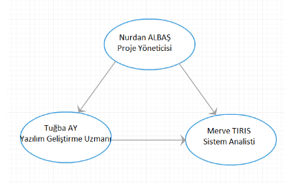

# Proje Yönetimi Dökümantasyonu

**Personel İzin Takip Programı**

**Proje Tanımı** 

Sağlık kurumunda çalışan personellerin izin takibinin yapılabileceği bir program geliştirilmesi.

 **Proje Amacı ve Kapsamı** 

Personel izinlerin belli bir sistem üzerinden verilmesi/alınması,personel izinlerinin türü,her personelin bilgilerinin sistemde tutulması,geçmiş izin günlerinin takibi,izin alan personellerin kayıtlarının tutulması,müdür ve personel ilişkilerinin kaydının tutulması. 

**Proje Ekip Organizasyonu** 

Bu projede herkese eşit görev verildiğinden dolayı demokratik yapı hakim olmuştur



**Gerçekleştirme**

```text
  public DoktorRapor() {
        initComponents();
        Date s = new Date();
        DateFormat sdf = new SimpleDateFormat("dd/MM/yyyy");
        jTextField7.setText(sdf.format(s));
        raporID();
        Doldur();
    }

    void raporID() {
        EntityManagerFactory emf = Persistence.createEntityManagerFactory("YazilimMuhPU");
        EntityManager em = emf.createEntityManager();
        Query q = em.createQuery("SELECT MAX(p.raporid) FROM Rapor p");

        int d = (int) q.getResultList().get(0);
        jTextField8.setText(String.valueOf(d + 1));

        em.close();
        emf.close();
    }

    void Doldur() {
        EntityManagerFactory emf = Persistence.createEntityManagerFactory("YazilimMuhPU");
        EntityManager em = emf.createEntityManager();
        Query q = em.createQuery("SELECT p FROM Hkayit p WHERE p.htcno = :tcno");
        q.setParameter("tcno", DoktorGirisEkrani.tcGonder);
        List<Hkayit> kisiList = q.getResultList();
        for (Hkayit tc : kisiList) {
            jTextField5.setText(tc.getHtcno());
            jTextField6.setText(tc.getHadsoyad());
            jTextField4.setText(tc.getHbabaadi());
            jTextField3.setText(tc.getHdtarih());
            jTextField2.setText(tc.getHdyer());
        }
        em.close();
        emf.close();
    }
```

| Gereksinim Analizi | Tasarım | Gerçekleştirme | Test |
| :--- | :--- | :--- | :--- |
| Bilgi Toplama | Genel Tasarım | Kodlama | Bütünleşik Test |
| Modelleme | Ayrıntılı Tasarım |  |  |
| Y.G.S hazırlama |  |  |  |
|  |  |  |  |

